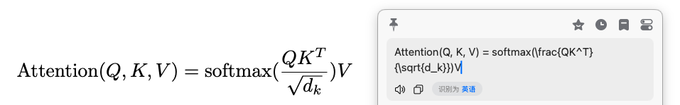

# BobLatex

一个使用LLM api进行Latex公式识别的Bob插件

# 使用说明

请前往Release页面下载 `.bobplugin` 文件, 并参考 [Bob插件使用教程](https://bobtranslate.com/guide/advance/plugin.html)

本插件默认使用阿里云的 `qwen-vl-max` 模型进行latex公式的OCR识别

因此, 您需要申请DashScope的api key. 详见: [Aliyun ApiKey申请](https://help.aliyun.com/zh/model-studio/get-api-key)

此外, 您也可以通过修改 `API URL` 参数, 来使用任意的OpenAI compatible API. 您也可以通过修改 `MODEL` 参数来自由选定模型.

# Thanks

*   [wakewon/bob-plugin-simpletex](https://github.com/wakewon/bob-plugin-simpletex)
